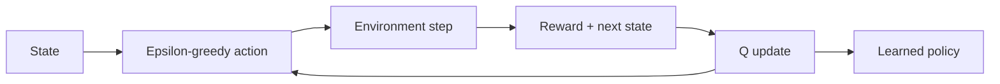

# Adaptive Q Learning Agent

[](https://www.python.org/) [](#testing) [](LICENSE)

> Train a Q-learning agent to learn navigation policies through reward and exploration.

## Why this project exists

An adaptive agent learns which actions lead to a goal without being given the optimal path in advance.

The implementation is intentionally small and reproducible so the underlying AI reasoning is easy to inspect, benchmark, and discuss.

## AI concepts demonstrated

Q-learning, epsilon-greedy exploration, learning rate, discount factor, reward shaping, policy extraction

## Architecture



## Results

On the deterministic demo seed, the final 20-episode average reward is **8.92** after 800 training episodes. The learned policy reaches the goal while respecting blocked cells.

These results are illustrative for the small environment, not production-scale performance claims.

## Project structure

```text
adaptive-q-learning-agent/
├── README.md
├── LICENSE
├── requirements.txt
├── examples/
│   └── demo.py
├── src/
│   └── implementation
└── tests/
    └── test_*.py
```

## Run locally

```bash
python -m venv .venv
# macOS/Linux
source .venv/bin/activate
# Windows PowerShell
# .venv\Scripts\Activate.ps1

pip install -r requirements.txt
PYTHONPATH=. python examples/demo.py
```

## Testing

```bash
PYTHONPATH=. pytest -q
```

## Ideas for extending the project

- Scale the environment or dataset and compare runtime and search behavior.
- Add richer visualizations or an interactive interface.
- Introduce additional baselines and ablation experiments.
- Add configuration files so experiments are reproducible from the command line.

## Portfolio note

This project is independently structured and documented as a portfolio implementation inspired by AI concepts studied in CS221. Do not publish course-provided starter code, solutions, tests, or restricted materials.

## GitHub metadata

**Repository name**

`adaptive-q-learning-agent`

**Description**

`Train a Q-learning agent to learn navigation policies through reward and exploration.`

**Topics**

`artificial-intelligence` `reinforcement-learning` `q-learning` `machine-learning` `exploration-exploitation` `python` `gridworld` `cs221`
